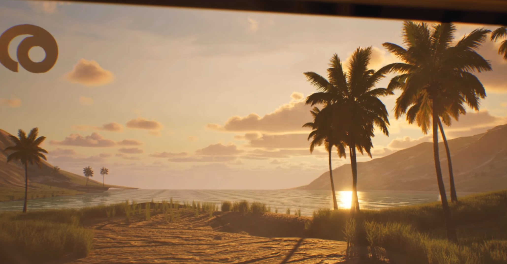
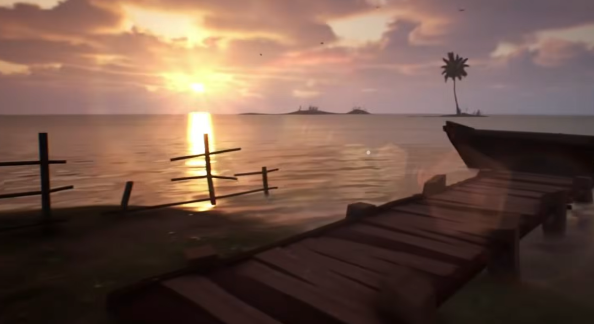
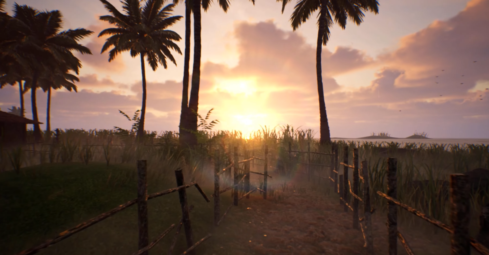
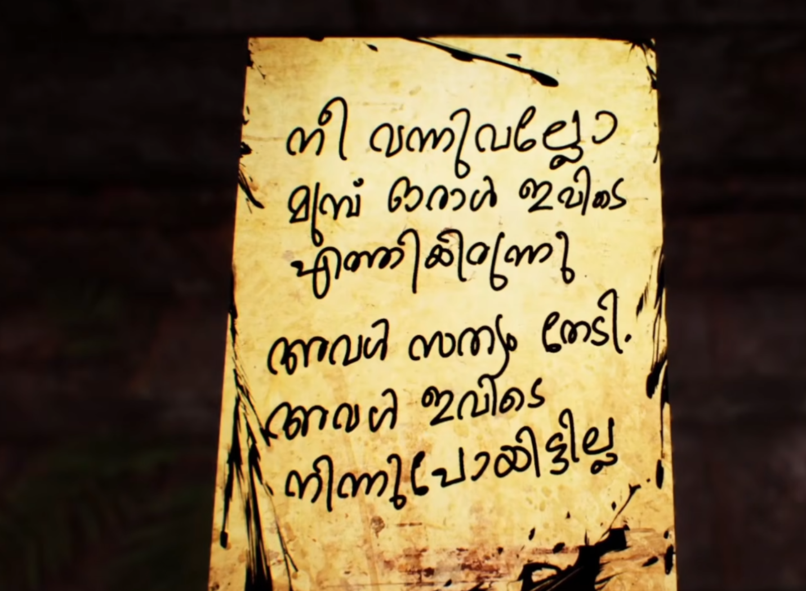
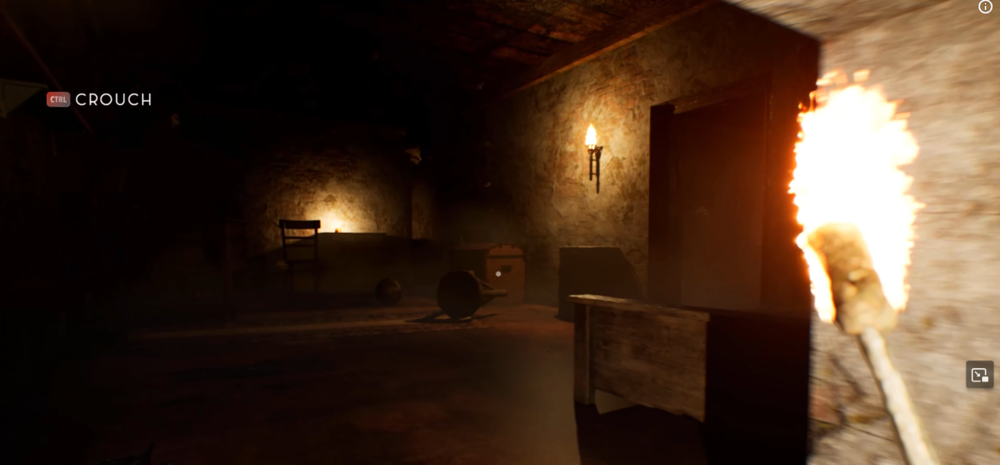
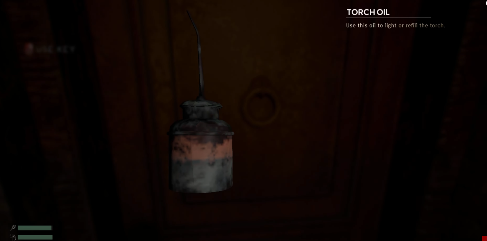
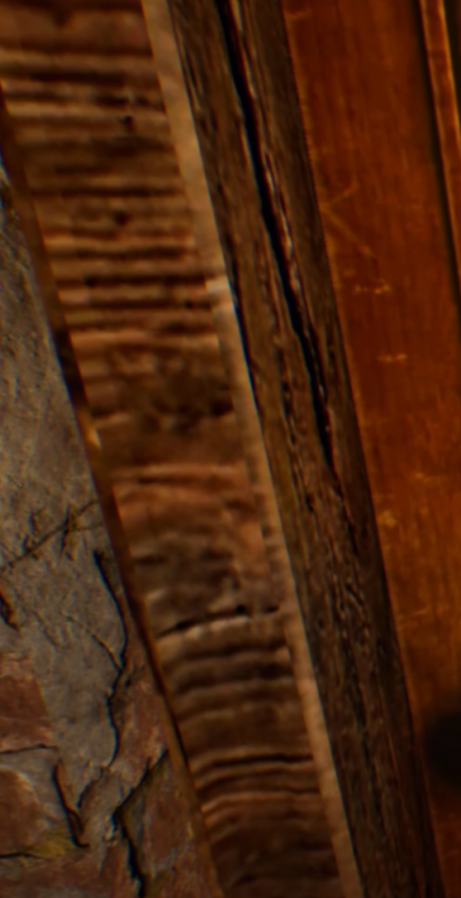
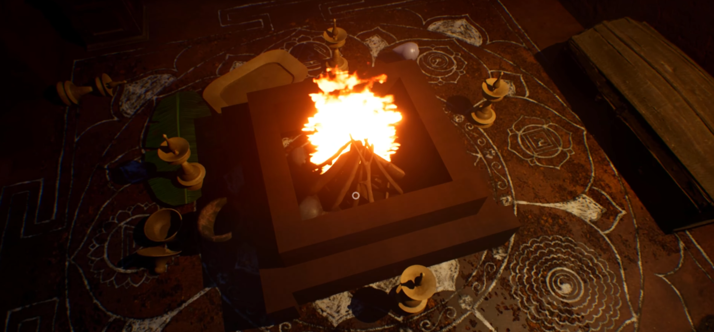

## Overview

<!-- Write your game overview here -->
<!-- What is Thekku Island? What's the premise? -->
So, Thekku Island has been popping up all over my feeds. It is a newly launched game by a small indie developer team based out of Kerala. There is a lot of hype going on about the game and this is my honest review about it with little to no spoilers.

I too panic bought this game just for the "home-grown" game is out vibes.

`LLMs were used for minor edits and sanity checks`

## Initial Reactions

The game is set in 1980s Kerala, India, where the protagonist is set out to find his missing wife. The initial reactions of opening the game, where you see the developer and publisher logos feels like the game's coming from one of the Assassin's Creed games. Clean transitions, crisp sound, smooth animations. S tier work right there.


Then when we land on the main menu, the game presents you with a really nice scene where it sets a spooky precedent with a soundtrack similar to the ones you find in a typical Malayalam Yakshi movie.


### Gameplay

<!-- Write about the gameplay mechanics -->
<!-- What are the core gameplay loops? How does it play? -->
The gameplay is very basic. It features a First Person View and there is minimal real world interaction. We start off in our house, where it is well decorated to show off a middle class Malayali house from the 80s. Radio, TV, Pooja room, study etc all fits in well. The radio plays soothing music when toggled, kind of reminds me of Akashavani FM, but yeah, nostalgic indeed.

Once we get out of the house we are shown an impressive cutscene, and this is literally the peak of the game in my opinion.
If you think that you would be able to hang out in that cutscene place then you would be disappointed.



We are directed to an island by some stranger who puts a set of coordinates at our doorstep, pretty weird if you would ask me. Once we are on the island, we can explore the island while the sun is setting in the horizon with a mild shower hitting the soil. It is kind of annoying how slow we move in the game, and if we start sprinting, we get tired really fast. Like barely 5 steps sprinting and suddenly there's an obnoxiously loud and irritating panting sound. This is probably because the game's map is very small.




On exploration, you will start finding these notes, which are like clues to progress throughout. The player has to use these clues to figure out how to open certain doors. On the island, there is a mansion located at the center. As you progress through the game, you would end up waking up in the night where the horror show begins inside the mansion.



Most of the game's lore notes are in Malayalam, subtitles/translations are provided and shouldn't be a problem apart from a set of scrapings in the wall. Those are not blockers so I guess non-Malayali players won't have any issues. As for the jump scares, pretty mid to be honest, it did catch me once or twice but nothing outstanding. Once you are progressing inside the mansion, you would only have one or two points where your game gets saved.


There is nothing major worth mentioning in the gameplay, just roam around, find notes and progress. The time required to complete the whole game is only 1-1.5 hours.

The game doesn't properly support controllers, the initial release didn't support at all, while the subsequent ones don't show button hints. The settings menu is very low effort and looks like it's made with HTML.

<!-- Write about visual style and audio -->
<!-- Art direction, music, sound effects -->
### Visuals

The graphics displayed in the cutscenes and initial parts of the game are decent, however as you progress, you would start seeing consistency issues here and there. There are low-quality props and textures which you would find in 90s-era GoldSrc games.




The quality of the ending cutscene is pretty bad, IMO, and was a huge let down for me. The game goes from an impressive-looking main menu scene to a decent 2D scene to a really good-looking agricultural sunset-blazing scene to a very mid and low-effort ending scene. I believe some consistency should have been maintained here.

The fires in the game are made with paper textures, even 20-year-old games have implemented fires better. Considering this was made with Unity, there should have been some community effect or another which could have been used.


The FPS also takes a hit due to fog I believe. Overall it looks very rushed and not complete.

### Sounds
The biggest hype around this game is the audio. I didn't like most of the sounds during the core part of the game. The background music is too noticeable when it repeats, panting sound kills my soul, sound from the fire is too loud. The audio balance and mixing are not done well. The random Yakshi taunts are also "too professionally recorded," I'd say, doesn't feel very natural to the ambience.

When you move around rainy areas, the sound of the rain feels like it's raining cats and dogs, but when you get back just 2 steps inside, there's literally no rain.

The scary music is doing its job during important phases but nothing that matches the hype.

Overall very mid.

### Story

The story is a typical Yakshi exorcism katha and I don't have anything else to say without spoilers. Although, I don't know how a random stranger gave us coordinates of the potential location of our wife and vanished. The ending sure does leave room for a potential sequel or DLC, hoping that there is some light shed on the stranger.

### Pros
- Kerala Vibes in a game 

### Cons
- Short game
- 340 Rs is too much for a 1-1.5h game
- No GNU/Linux support (not even with Proton), Deck gamers have to wait for support
- Controller Support isn't good


### Verdict

Overall the game doesn't feel fully polished and has consistency gaps here and there. Given the short game span, the developers could have taken a few more months to fully finish the game and release it. As with most Steam game reviews, I'll use a copypasta to convey my verdict. I have also given consideration to the newly emerging game development scene in Kerala. I'm still attributing a token of appreciation for the hard work put in by the Developers.

```
--{ Graphics }---
☐ You forget what reality is
☐ Beautiful
☐ Good
☐ Decent
☑ Bad
☐ Don‘t look too long at it
☐ MS-DOS

---{ Gameplay }---
☐ Very good
☐ Good
☑ It's just gameplay
☐ Mehh
☐ Watch paint dry instead
☐ Just don't

---{ Audio }---
☐ Eargasm
☐ Very good
☐ Good
☑ Not too bad
☐ Bad
☐ I'm now deaf

---{ Audience }---
☑ Kids
☑ Teens
☐ Adults
☐ Grandma

---{ PC Requirements }---
☐ Check if you can run paint
☐ Potato
☑ Decent
☐ Fast
☐ Rich boi
☐ Ask NASA if they have a spare computer

---{ Game Size }---
☐ Floppy Disk
☑ Old Fashioned
☐ Workable
☐ Big
☐ Will eat 15% of your 1TB hard drive
☐ You will want an entire hard drive to hold it
☐ You will need to invest in a black hole to hold all the data

---{ Difficulty }---
☐ Just press 'W'
☑ Easy
☐ Easy to learn / Hard to master
☐ Significant brain usage
☐ Difficult
☐ Dark Souls

---{ Grind }---
☑ Nothing to grind
☐ Only if u care about leaderboards/ranks
☐ Isn't necessary to progress
☐ Average grind level
☐ Too much grind
☐ You'll need a second life for grinding

---{ Story }---
☐ No Story
☑ Some lore
☐ Average
☐ Good
☐ Lovely
☐ It'll replace your life

---{ Game Time }---
☑ Long enough for a cup of coffee
☐ Short
☐ Average
☐ Long
☐ To infinity and beyond

---{ Price }---
☐ It's free!
☐ Worth the price
☐ If it's on sale
☐ If u have some spare money left
☑ Not recommended
☐ You could also just burn your money

---{ Bugs }---
☐ Never heard of
☐ Minor bugs
☑ Can get annoying
☐ ARK: Survival Evolved
☐ The game itself is a big terrarium for bugs

```
Overall: 6/10
